# Sistem Administrasi RT — Perumahan Elite

Aplikasi untuk mengelola administrasi pembayaran iuran dan pengeluaran di perumahan.

## Tech Stack

| Layer    | Technology      | Version |
| -------- | --------------- | ------- |
| Backend  | Laravel (PHP)   | 13.x    |
| Frontend | React (Vite)    | 19.x    |
| Database | MySQL           | 8.x     |
| Auth     | Laravel Sanctum | 4.x     |
| Charts   | Recharts        | 3.x     |

## Prasyarat

Pastikan sudah terinstall:

- **PHP** >= 8.2
- **Composer** >= 2.x
- **Node.js** >= 18.x
- **NPM** >= 9.x
- **MySQL** >= 8.x (bisa menggunakan XAMPP/Laragon)

## Panduan Instalasi

### 1. Clone Repository

```bash
git clone <repository-url>
cd sistem-administrasi-rt
```

### 2. Setup Backend (Laravel)

```bash
cd backend

# Install PHP dependencies
composer install

# Copy environment file
cp .env.example .env

# Generate application key
php artisan key:generate
```

### 3. Konfigurasi Database

Edit file `backend/.env` dan sesuaikan pengaturan database MySQL:

```env
DB_CONNECTION=mysql
DB_HOST=127.0.0.1
DB_PORT=3306
DB_DATABASE=rt_admin
DB_USERNAME=root
DB_PASSWORD=
```

> **Note:** Sesuaikan `DB_PORT` dengan port MySQL Anda (default 3306, atau 5306 jika menggunakan XAMPP dengan port custom)

### 4. Install Sanctum API

```bash
php artisan install:api
```

Jika ditanya konfirmasi, pilih **Yes**.

### 5. Buat Database, Tabel, & Isi Data (Migrasi & Seeder)

```bash
php artisan migrate:fresh --seed
```

> **Note:** Jika muncul pertanyaan `The database 'rt_admin' does not exist... Would you like to create it?`, ketik **yes** lalu Enter. Laravel akan otomatis membuatkan databasenya untuk Anda.

Ini akan membuat database, membuat semua tabel dan mengisi data sample:

- 1 Admin user (email: `admin@rt.com`, password: `password`)
- 20 Rumah (Blok A-1 sampai A-20)
- 20 Penghuni (15 tetap, 5 kontrak)
- Sample pembayaran 6 bulan terakhir
- Sample pengeluaran

### 6. Buat Storage Link

```bash
php artisan storage:link
```

### 7. Jalankan Backend Server

```bash
php artisan serve
```

Backend akan berjalan di `http://localhost:8000`

### 8. Setup Frontend (React)

Buka terminal baru:

```bash
cd frontend

# Install JavaScript dependencies
npm install

# Jalankan development server
npm run dev
```

Frontend akan berjalan di `http://localhost:5173`

### 9. Akses Aplikasi

Buka browser dan akses: **http://localhost:5173**

Login dengan:

- **Email:** `admin@rt.com`
- **Password:** `password`

## Fitur Aplikasi

### 1. Dashboard

- Ringkasan statistik (total rumah, penghuni, pemasukan, pengeluaran)
- Grafik mini pemasukan vs pengeluaran 6 bulan terakhir
- Aktivitas terbaru

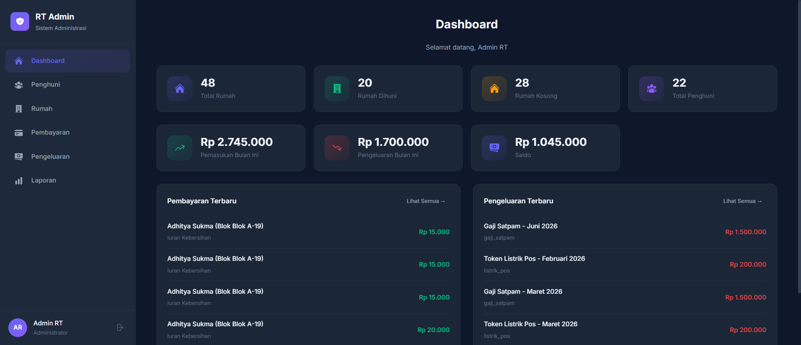

### 2. Kelola Penghuni

- Daftar penghuni dengan pencarian
- Tambah / Edit penghuni
- Upload foto KTP
- Status: Tetap / Kontrak
- Status pernikahan

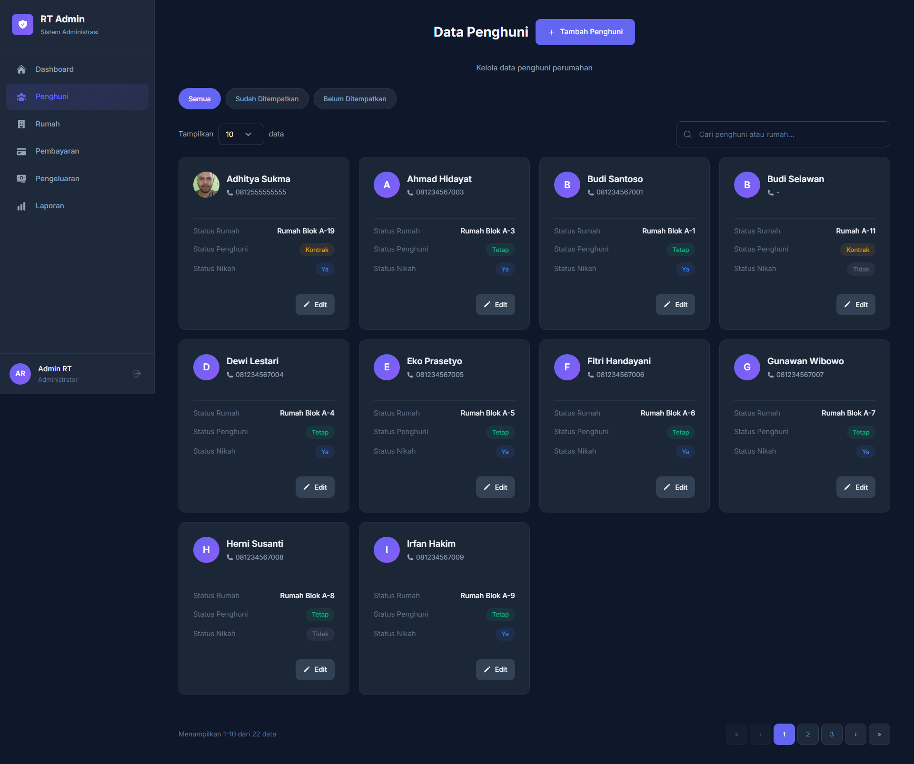

- Form Penghuni

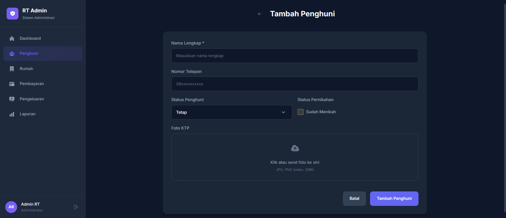

### 3. Kelola Rumah

- Grid tampilan 20 rumah dengan status (Dihuni / Tidak Dihuni)
- Tambah / Edit rumah
- Assign / Hapus penghuni dari rumah
- Riwayat penghuni (historical)
- Riwayat pembayaran per rumah

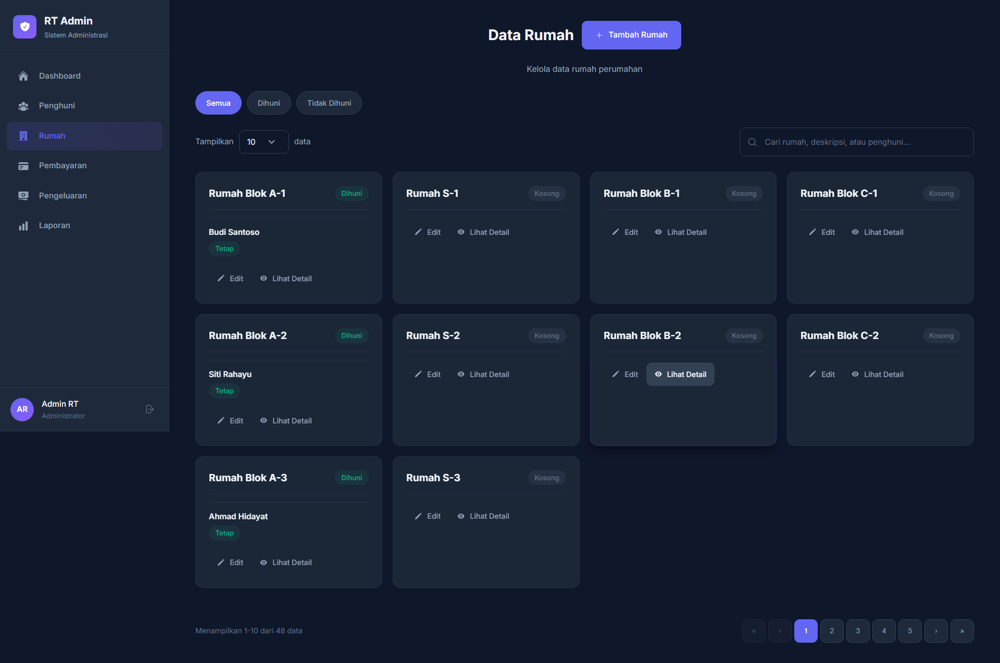

- Form Rumah

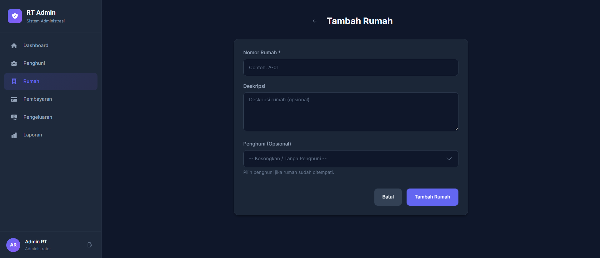

- Detail Rumah

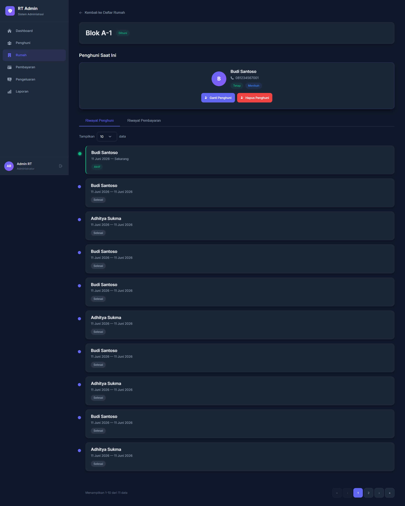

### 4. Pembayaran Iuran

- Status pembayaran per bulan (Lunas / Belum)
- Iuran Kebersihan: Rp 15.000/bulan
- Iuran Satpam: Rp 100.000/bulan
- Dukungan pembayaran multi-bulan (contoh: 1 tahun sekaligus)

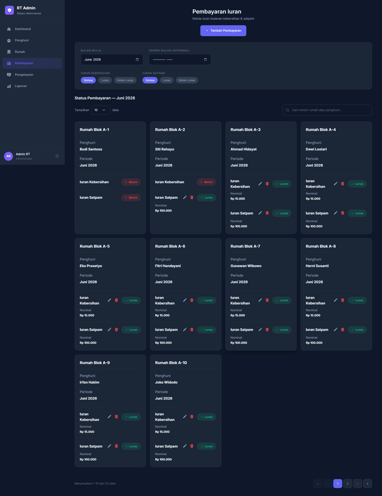

- Form Pembayaran

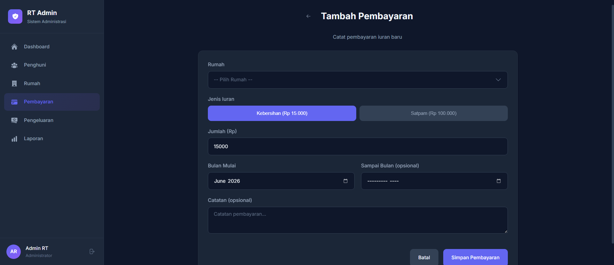

### 5. Pengeluaran

- Catat pengeluaran bulanan (gaji satpam, listrik pos, perbaikan, dll)
- Kategori: Gaji Satpam, Token Listrik, Perbaikan Jalan, Perbaikan Selokan, Lainnya
- Pengeluaran rutin & non-rutin

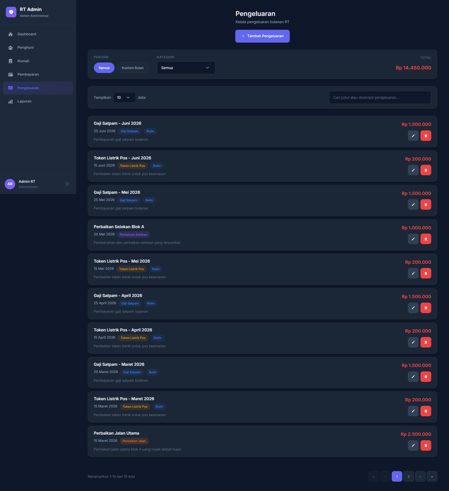

- Form Pengeluaran

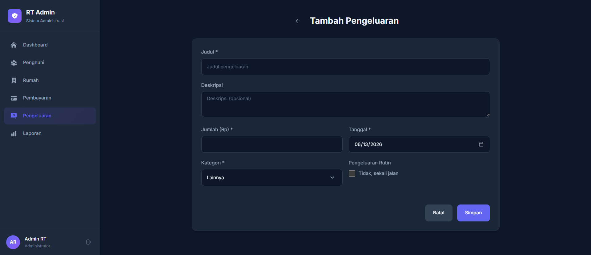

### 6. Laporan Keuangan

Fitur laporan keuangan menyediakan:

- Ringkasan total pemasukan tahunan
- Ringkasan total pengeluaran tahunan
- Saldo tahunan
- Grafik pemasukan vs pengeluaran selama 12 bulan
- Detail pemasukan bulanan
- Detail pengeluaran bulanan
- Saldo per bulan

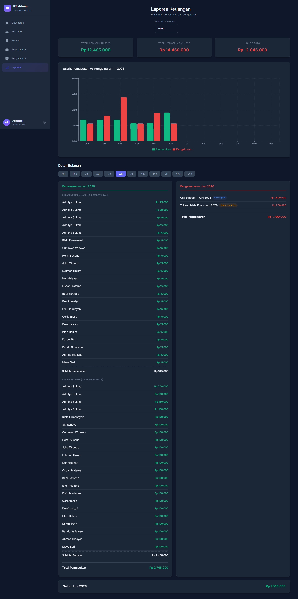

## ERD (Entity Relationship Diagram)

```
┌──────────────┐     ┌──────────────────┐     ┌──────────────┐
│   residents  │     │  house_residents  │     │    houses     │
├──────────────┤     ├──────────────────┤     ├──────────────┤
│ id (PK)      │────<│ id (PK)          │>────│ id (PK)      │
│ name         │     │ house_id (FK)    │     │ house_number │
│ phone        │     │ resident_id (FK) │     │ status       │
│ ktp_photo    │     │ start_date       │     │ description  │
│ status       │     │ end_date         │     │ created_at   │
│ is_married   │     │ is_active        │     │ updated_at   │
│ created_at   │     │ created_at       │     └──────────────┘
│ updated_at   │     │ updated_at       │
└──────────────┘     └────────┬─────────┘
                              │
                              │
                     ┌────────┴─────────┐
                     │    payments      │
                     ├──────────────────┤
                     │ id (PK)          │     ┌──────────────┐
                     │ house_resident_id│     │   expenses   │
                     │ type             │     ├──────────────┤
                     │ amount           │     │ id (PK)      │
                     │ period_month     │     │ title        │
                     │ paid_at          │     │ description  │
                     │ notes            │     │ amount       │
                     │ created_at       │     │ expense_date │
                     │ updated_at       │     │ category     │
                     └──────────────────┘     │ is_recurring │
                                              │ created_at   │
                                              │ updated_at   │
                                              └──────────────┘
```

### Relasi:

- **residents** 1:N **house_residents** (satu penghuni bisa pernah tinggal di beberapa rumah)
- **houses** 1:N **house_residents** (satu rumah bisa punya riwayat beberapa penghuni)
- **house_residents** 1:N **payments** (satu assignment penghuni-rumah bisa punya banyak pembayaran)
- **expenses** berdiri sendiri (tidak terkait rumah/penghuni tertentu)

## API Endpoints

| Method         | Endpoint                                 | Deskripsi                   |
| -------------- | ---------------------------------------- | --------------------------- |
| POST           | `/api/login`                             | Login admin                 |
| POST           | `/api/logout`                            | Logout                      |
| GET            | `/api/user`                              | Data user yang login        |
| GET            | `/api/dashboard`                         | Data dashboard              |
| GET/POST       | `/api/residents`                         | List / Tambah penghuni      |
| GET/PUT        | `/api/residents/{id}`                    | Detail / Update penghuni    |
| POST           | `/api/residents/{id}/photo`              | Upload foto KTP             |
| DELETE         | `/api/residents/{id}/photo`              | Hapus foto KTP              |
| GET            | `/api/residents/{id}/photo-view`         | Lihat file foto KTP         |
| GET/POST       | `/api/houses`                            | List / Tambah rumah         |
| GET/PUT        | `/api/houses/{id}`                       | Detail / Update rumah       |
| POST           | `/api/houses/{id}/assign-resident`       | Assign penghuni ke rumah    |
| PUT            | `/api/houses/{id}/remove-resident/{rid}` | Hapus penghuni dari rumah   |
| GET            | `/api/houses/{id}/history`               | Riwayat penghuni rumah      |
| GET            | `/api/houses/{id}/payment-history`       | Riwayat pembayaran rumah    |
| GET/POST       | `/api/payments`                          | List / Tambah pembayaran    |
| GET/PUT/DELETE | `/api/payments/{id}`                     | Detail / Update / Hapus     |
| GET            | `/api/payments/status`                   | Status pembayaran per bulan |
| GET/POST       | `/api/expenses`                          | List / Tambah pengeluaran   |
| GET/PUT/DELETE | `/api/expenses/{id}`                     | Detail / Update / Hapus     |
| GET            | `/api/reports/summary?year=2026`         | Ringkasan tahunan           |
| GET            | `/api/reports/monthly/{year}/{month}`    | Detail bulanan              |

### Dokumentasi Query Parameters (Filter)

Beberapa _endpoint_ mendukung pemfilteran data secara spesifik dengan menambahkan _query parameters_ pada URL:

**1. `GET /api/payments/status`**

- `start_year` & `start_month`: Menentukan rentang waktu awal (wajib).
- `end_year` & `end_month`: Menentukan rentang waktu akhir (opsional).

**2. `GET /api/expenses`**

- `start_month`: Menampilkan pengeluaran mulai dari bulan tertentu (contoh: `2026-05`).
- `end_month`: Menampilkan pengeluaran sampai batas bulan tertentu (opsional). Jika dikosongkan, mesin hanya akan menampilkan data persis di `start_month` saja.
- `category`: Memfilter pengeluaran berdasarkan kategori (contoh: `gaji_satpam`, `listrik_pos`, `perbaikan_jalan`).

## Struktur Proyek

```
jagoanhosting/
├── backend/                  # Laravel API
│   ├── app/
│   │   ├── Http/Controllers/Api/
│   │   │   ├── AuthController.php
│   │   │   ├── DashboardController.php
│   │   │   ├── ExpenseController.php
│   │   │   ├── HouseController.php
│   │   │   ├── PaymentController.php
│   │   │   ├── ReportController.php
│   │   │   └── ResidentController.php
│   │   └── Models/
│   │       ├── Expense.php
│   │       ├── House.php
│   │       ├── HouseResident.php
│   │       ├── Payment.php
│   │       ├── Resident.php
│   │       └── User.php
│   ├── database/
│   │   ├── migrations/
│   │   └── seeders/DatabaseSeeder.php
│   └── routes/api.php
├── frontend/                 # React App
│   ├── src/
│   │   ├── components/       # Reusable components
│   │   ├── contexts/         # Auth context
│   │   ├── pages/            # All pages
│   │   ├── services/api.js   # API layer
│   │   └── utils/helpers.js  # Utilities
│   └── package.json
└── README.md
```
